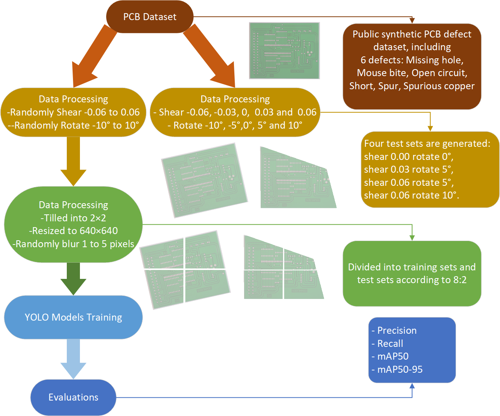

# VR-YOLO: Enhancing PCB Defect Detection with Viewpoint Robustness Based on YOLO

<div align="center">
  
</div>

We propose an enhanced PCB defect detection algorithm, named VR-YOLO, based on the YOLOv8 model. This algorithm aims to improve the model's generalization performance and enhance viewpoint robustness in practical application scenarios.

### Install
```
conda create --name VR-YOLO python=3.9
conda activate VR-YOLO
pip install -r requirements.txt
```
You can also choose to install from the YOLO project homepage [YOLO](https://github.com/ultralytics/ultralytics), but since the project is constantly evolving, you will need to replace some of the dependencies yourself:
```
pip install ultralytics
```

### Training
Run the following script to perfom training
```
cd ultralytics
python train.py
```
You can also find the pre-trained models here: model/SRSGS+CBAM+SIOU.pt.

### Inference
Run the following script to perfom inference
```
cd ultralytics
python test.py
```
You can optionally replace the model with one you trained yourself.

### Acknowledgements

This repo is largely based on [YOLO](https://github.com/ultralytics/ultralytics). Attention: This is a very iterative project. We are building on YOLOv8.
